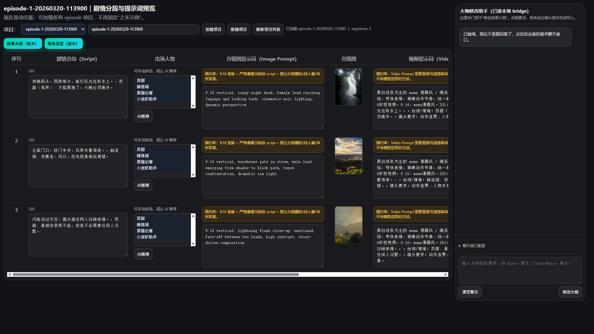

[](https://qm.qq.com/cgi-bin/qm/qr?k=kSKwz-HRqrddrALgfLqCp7C2-aGZqPlv&jump_from=webapi&authKey=KUwPZ1lgzoIXjwIf/AfQ0UFFhRcUAO8VAdZk2kVdrGHQhxyhlgn30vX1SCX5Lu8d) (群号: 83958598)

# 10sVideoFlow · Grok Storyboard Preview

本目录是一个本地分镜预览与右侧聊天桥接工具包，用于快速查看 `zhihe-storyboard-preview-flashback.html` 并通过本地 bridge 接入 OpenClaw Gateway。

## 演示截图

> 你可以直接把这张图发给用户用于演示。



## 功能概览

- 本地静态预览页（默认端口 `12731`）
- 本地聊天 bridge（默认端口 `12732`）
- 统一 `/v1/chat/completions` 接口给预览页调用
- OpenClaw Gateway 健康检查与会话转发适配
- 可选 guard（限制只处理剧本/分镜/图片/声音相关请求）

## 目录结构

```text
.
├─ assets/
│  └─ zhihe-storyboard-preview-flashback.html
├─ demo-screenshots/
│  └─ 01-filled-home-1920x1080.png
├─ bridge-config.json
├─ bridge-server.js
├─ preview-server.js
├─ start-chat-bridge.bat
├─ start-local-preview.bat
└─ SKILL.md
```

## 快速开始

### 1) 启动聊天 bridge

双击运行：

- `start-chat-bridge.bat`

### 2) 启动本地预览服务

双击运行：

- `start-local-preview.bat`

### 3) 打开预览页

```text
http://127.0.0.1:12731/zhihe-storyboard-preview-flashback.html?chatBase=http://127.0.0.1:12732&chatPath=/v1/chat/completions
```

## 默认端口

- 预览页静态服务：`12731`
- 聊天 bridge：`12732`
- OpenClaw Gateway（默认）：`18789`

## 健康检查

- 预览页：
  - `http://127.0.0.1:12731/zhihe-storyboard-preview-flashback.html?chatBase=http://127.0.0.1:12732&chatPath=/v1/chat/completions`
- bridge：
  - `http://127.0.0.1:12732/health`
- OpenClaw Gateway：
  - `http://127.0.0.1:18789/healthz`
  - `http://127.0.0.1:18789/readyz`

## 配置说明

主要配置文件：`bridge-config.json`

关键字段：

- `mode`：运行模式（默认 `openclaw`）
- `gatewayBase`：Gateway 基地址
- `defaultSessionKey`：默认会话（通常 `main`）
- `defaultModel`：默认模型
- `openclawAdapter`：适配器模式
- `guard`：请求范围限制（可开关）

## 常见问题

1. **页面打不开**：先检查 12731 是否监听。  
2. **右侧聊天不通**：检查 12732 与 `/health`。  
3. **Gateway 不可用**：检查 `18789/healthz` 与 `18789/readyz`。  
4. **端口占用**：重启脚本，或结束旧进程后再启动。  
5. **内容不刷新**：浏览器 `Ctrl + F5` 强制刷新。

## 说明

- 本项目主要用于本地开发与预览，不是 OpenClaw 内置页面。
- 浏览器页面通过本地 bridge 调 Gateway，避免直接耦合 runtime。

---

如需完整技能说明与维护细节，请查看 `SKILL.md`。
